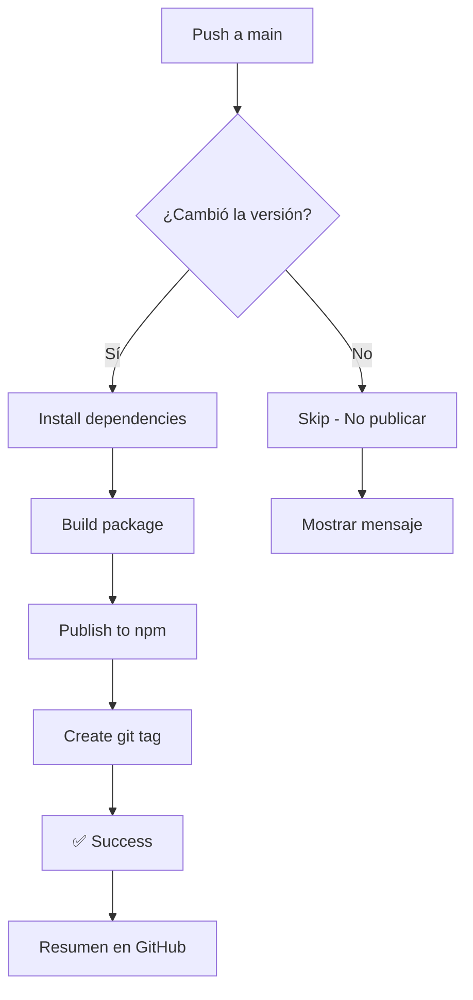

# Guía de Publicación Automática en NPM

Esta guía explica cómo funciona el workflow de publicación automática de `da-proj` en npm.

## 🎯 Cómo Funciona

El workflow de GitHub Actions (`publish-npm.yml`) se activa automáticamente cuando:

- Haces push a la rama `main`
- Se modifican archivos en `package.json`, `src/**`, o `index.ts`

**Importante:** El workflow **solo publicará** si detecta que la versión en `package.json` cambió desde el último commit.

## 📝 Proceso de Publicación

### 1. Actualizar la Versión

Antes de hacer commit, actualiza manualmente la versión en `package.json`:

```bash
# Opción 1: Editar manualmente package.json
# Cambia "version": "1.0.0" a "version": "1.0.1"

# Opción 2: Usar npm version (recomendado)
npm version patch  # 1.0.0 → 1.0.1
npm version minor  # 1.0.0 → 1.1.0
npm version major  # 1.0.0 → 2.0.0
```

### 2. Actualizar el CHANGELOG

Documenta los cambios en `CHANGELOG.md`:

```markdown
## [1.0.1] - 2026-01-14

### Added

- Nueva funcionalidad X

### Fixed

- Bug Y corregido
```

### 3. Commit y Push

```bash
git add package.json CHANGELOG.md
git commit -m "chore: bump version to 1.0.1"
git push origin main
```

### 4. Verificar la Publicación

El workflow automáticamente:

- ✅ Detecta el cambio de versión
- ✅ Instala dependencias
- ✅ Compila el paquete (`bun run build`)
- ✅ Publica en npm
- ✅ Crea un git tag (ej: `v1.0.1`)
- ✅ Genera un resumen en GitHub Actions

## 🔐 Configuración Inicial (Una Sola Vez)

### Paso 1: Obtener NPM Token

1. Ve a [npmjs.com](https://www.npmjs.com) e inicia sesión
2. Click en tu avatar → **Access Tokens**
3. Click en **Generate New Token** → **Classic Token**
4. Selecciona **Automation** (para CI/CD)
5. Copia el token generado (empieza con `npm_...`)

### Paso 2: Configurar GitHub Secret

```bash
# Opción 1: Usando GitHub CLI (recomendado)
gh secret set NPM_TOKEN

# Pega tu token cuando te lo pida

# Opción 2: Manual
# 1. Ve a tu repo en GitHub
# 2. Settings → Secrets and variables → Actions
# 3. Click "New repository secret"
# 4. Name: NPM_TOKEN
# 5. Value: [pega tu token]
# 6. Click "Add secret"
```

### Verificar Configuración

```bash
# Ver si el secret está configurado
gh secret list

# Debería mostrar:
# NPM_TOKEN  Updated YYYY-MM-DD
```

## 🚦 Estrategias de Versionado

Sigue [Semantic Versioning](https://semver.org/):

- **Patch** (1.0.0 → 1.0.1): Bug fixes, cambios menores
- **Minor** (1.0.0 → 1.1.0): Nuevas funcionalidades (backward compatible)
- **Major** (1.0.0 → 2.0.0): Breaking changes

### Ejemplos

```bash
# Bug fix
npm version patch
git commit -m "fix: corregir validación de URLs"

# Nueva funcionalidad
npm version minor
git commit -m "feat: agregar soporte para templates"

# Breaking change
npm version major
git commit -m "feat!: cambiar estructura de comandos"
```

## 🔍 Monitoreo

### Ver Estado del Workflow

```bash
# Ver workflows recientes
gh run list --workflow=publish-npm.yml

# Ver detalles de la última ejecución
gh run view
```

### Verificar Publicación en NPM

```bash
# Ver versión publicada
npm view da-proj version

# Ver todas las versiones
npm view da-proj versions

# Instalar la última versión
npm install -g da-proj@latest
```

## ⚠️ Troubleshooting

### El workflow no se ejecutó

**Causa:** La versión en `package.json` no cambió.

**Solución:**

```bash
# Verifica la versión actual
cat package.json | grep version

# Incrementa la versión
npm version patch
git push origin main
```

### Error: "You cannot publish over the previously published versions"

**Causa:** Intentaste publicar una versión que ya existe en npm.

**Solución:**

```bash
# Incrementa la versión nuevamente
npm version patch
git push origin main
```

### Error: "Unable to authenticate"

**Causa:** El `NPM_TOKEN` no está configurado o es inválido.

**Solución:**

```bash
# Regenera el token en npmjs.com
# Actualiza el secret en GitHub
gh secret set NPM_TOKEN
```

### El build falla

**Causa:** Error en la compilación del código.

**Solución:**

```bash
# Prueba el build localmente
bun run build

# Revisa los errores y corrígelos
# Luego haz commit y push nuevamente
```

## 📊 Workflow Completo



## 🎓 Mejores Prácticas

1. **Siempre actualiza el CHANGELOG** antes de publicar
2. **Usa mensajes de commit descriptivos** que expliquen los cambios
3. **Prueba localmente** con `bun run build` antes de hacer push
4. **Sigue Semantic Versioning** para mantener compatibilidad
5. **Revisa el workflow** en GitHub Actions después de cada push

## 🔗 Referencias

- [npm Documentation](https://docs.npmjs.com/)
- [Semantic Versioning](https://semver.org/)
- [GitHub Actions](https://docs.github.com/en/actions)
- [Bun Documentation](https://bun.sh/docs)
